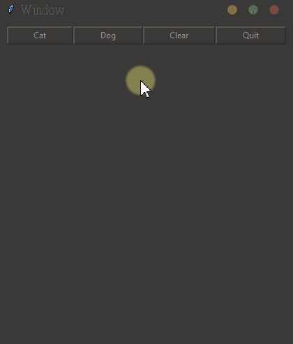
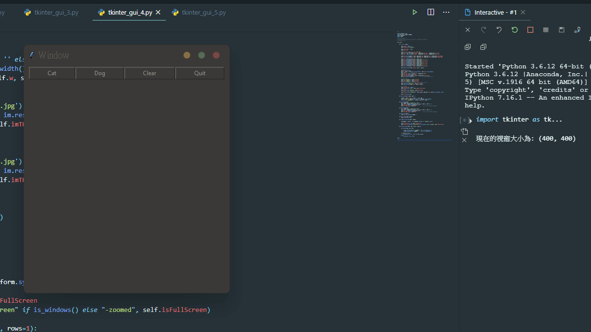
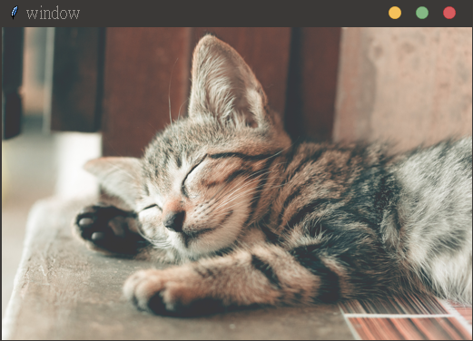
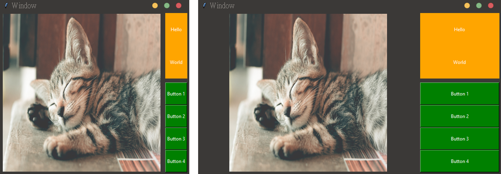

# Tkinter_Basic_1
基礎的Tkinter教學與實作，基本UI、**影響串流**、**圖片動態縮放**

## Featured DEMO

|   [影像串流](#05)        |  [圖片動態縮放](#06)             |
|   :---                     |   :---           |
|     |     |
|   [按鈕事件](#04)        |   [圖片靜態縮放](#06) |
|     |   

## Overview

|   Index   |   Name                |   Discription
|   ---     |   ---                 |   ---         |
|   01      |   [01_gui_simple.py](#01)    |   簡單介面範例
|   02      |   [02_gui_grid.py](#02)      |   元件動態縮放
|   03      |   [03_fullScreen.py](#03)    |   Win、Ubuntu 全螢幕 ( 無DEMO )
|   04      |   [04_btEvent.py](#04)       |   按鈕事件: 點擊按鈕產生圖片
|   05      |   [05_videoStream.py](#05)   |   影像串流、離開對話窗
|   06      |   [06_resize.py](#06)        |   圖片動態縮放: 縮放視窗圖片跟著縮放  圖片靜態縮放: 縮放視窗，重新開啟圖片自動適配大小
|   07      |   [07_game.py](#07)          |   對話窗小遊戲

---

## DEMO

### * <a id="01">./code/01_gui_simple.py</a>

### * <a id="02">./code/02_gui_grid.py</a>

### * <a id="03">./code/03_fullScreen.py</a>

### * <a id="04">./code/04_btEvent.py</a>

### * <a id="05">./code/05_videoStream.py</a>

### * <a id="06">./code/06_resize.py</a>    

* 靜態

* 動態

* <a id="07">./code/07_game.py</a>

